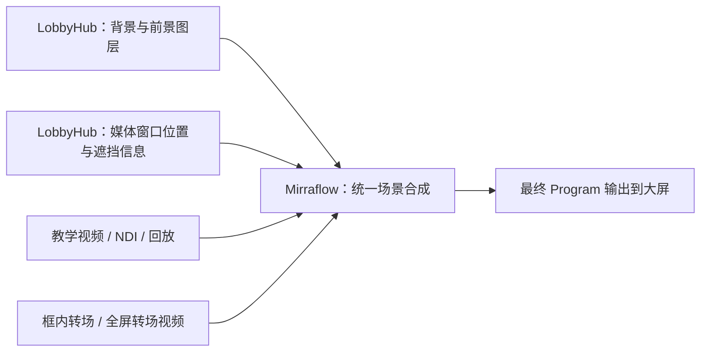

# LobbyHub × Mirraflow：画面优先与媒体窗口架构

更新：2026-09-09。状态：V0 逐状态诊断和 V1a 实时整场 GPU 桥接之后，按当前优先级提前实现完整 Lobby ↔ 一路 NDI 的独立全屏 Alpha 转场原型，复用 Mirraflow 原生 GPU 合成器。运行和验收边界见 [整场转场契约](mirra-lobby-ndi-switch-v1.md)。正式 Editor 来源注册、框内独立媒体图层与布局同步仍待开发；音频保持下一阶段。此前实时桥接结果见 [V1 契约](mirra-lobby-live-v1.md)。

本轮代码与边界见 [V0 视觉诊断契约](mirra-visual-probe-v0.md) 和 [实验运行说明](../electron/visual-probe/README.md)。新增实现不被正式启动或播放路径导入。16 个对比样本使用实际 GStreamer 解码的普通/Alpha 测试视频，但通过暂停取样、GPU readback 和 CPU 参考合成完成；不是实时 Program，也不是 V1 NDI 转场验收。原生产构建的 200 个文件（Lobby dist 和 Mirraflow 两个主程序）在回归前后 SHA256 一致。

本文替代此前“Mirraflow 框内合成 → Lobby 页面 → Mirraflow 最终输出”的首选方案。旧方案保留为图层导出无法可靠实现时的备选，不再作为默认开发路线。

## 1. 用户需要看到的效果

- Ready Room 现有教学视频框可以显示教学视频、实时 NDI 和回放视频。
- 框内来源通过转场视频切换，框外人物、标题、背景和动画继续正常运行。
- 框可以保留网页实现的边框、发光和装饰，也可以使用视频自带的透明/半透明边框，或明确选择组合使用。
- 完整 Lobby 场景可以通过全屏转场切换到另一段视频或 NDI。
- 最终在同一台播控电脑运行，以一个产品入口操作。代码可分仓库维护，运行时可保留独立进程；统一安装包和启动管理仍待开发。

## 2. 首选架构：由 Mirraflow 统一合成

LobbyHub 继续使用现有网页技术渲染人物、文字、背景和边框，将需要的图层与媒体窗口布局交给 Mirraflow。教学、NDI、回放由 Mirraflow 直接接收、解码和放置，不先进入 Lobby 浏览器再返回。

观众仍然看到“视频在网页边框里面”。技术上视频层与网页图层在 Mirraflow 中组合，媒体画面不需要跨两个应用往返。浏览器可保留管理、布局预览和独立运行模式，但浏览器预览不作为最终合成结果的唯一证据。

“整个 Lobby”在这里是 Mirraflow 内的一个场景组，包含网页图层、媒体窗口及其前景效果。做全屏转场时切换这个完整场景组，不需要先把它编码成视频流再解码。实现可以有多个 GPU 合成步骤或中间纹理，不承诺只有一次 GPU 绘制。

## 3. 画质、延迟与技术选择

画面嵌套不必然等于再次有损压缩。重复编码可能损失画质；GPU 纹理合成通常不需要视频重新编码，但仍有缩放、色彩转换、显存带宽和同步成本。设计目标是减少不必要的往返和重复采样，不宣称绝对无损、零复制或零延迟。

- 优先验证同机 GPU 共享纹理，从 Lobby 向 Mirraflow 传递界面图层。
- 统一验证分辨率、像素格式、色彩空间、透明度约定及缩放策略；避免先缩小成监看画面再放大到正式输出。
- 现有 MJPEG 监看可用于诊断和内容预览，不作为顺畅播控的默认生产链路或最终性能验收证据。
- Electron 官方提供离屏共享 GPU 纹理输出，支持网页 GPU 渲染；相关接口的版本兼容、GPU adapter、句柄复制和资源释放仍需实际验证。
- 静止网页可能没有新帧：保留最后有效图层，并用独立心跳判断进程存活；不得直接将“没有新帧”当作故障。

参考：[Electron Offscreen Rendering](https://www.electronjs.org/docs/latest/tutorial/offscreen-rendering)、[OffscreenSharedTexture](https://www.electronjs.org/docs/latest/api/structures/offscreen-shared-texture)。

## 4. 媒体窗口与图层职责

“媒体窗口”是一个稳定的布局位置，不绑定某一个教学视频文件。来源、边框样式和转场分别选择，换成回放或 NDI 时复用同一窗口。

| 内容 | 主要职责方 | 合成要求 |
|---|---|---|
| Lobby 背景、舞台、人物、标题、动画 | LobbyHub | 保留现有视觉与动画属性的单一控制者 |
| 教学视频、NDI、回放视频 | Mirraflow | 准备来源、解码、缩放/裁切、按布局放置 |
| 网页边框、发光、扫描线、标签 | LobbyHub | 按原有遮挡关系导出带透明度图层 |
| 视频自带的 Alpha 边框 | Mirraflow | 保留素材透明度及必要的框外显示范围 |
| 框内转场与全屏转场 | Mirraflow | 同一调度体系，明确各自影响区域 |
| 最终音频混音及 Crossfade | Sound Transmitter | 后续接入，复用已有 P1 能力 |

背景、媒体、前景是逻辑层次，不代表所有网页元素都能简单归为固定三张图片。若人物、地板、光效与视频交错遮挡，应按实际关系导出必要的图层或遮罩。不要把整张网页最终画面直接挖洞，否则可能同时抹去人物、边框和光效。

现有边框由网页实现，原则上继续复用原代码；不以重写成另一套原生边框动画作为首个实施步骤。

## 5. 两种边框与 Alpha 素材

### 网页边框

网页负责边框样式与动画，Mirraflow 将媒体置于对应区域。可按内容显式选择保留、切换或关闭网页边框。边框的阴影、半透明区域、扫描线和装饰必须保留正确的混合与前后顺序。

### 视频自带边框

素材必须真正包含 Alpha 通道，Mirraflow 才能让半透明位置透出 Lobby 背景。已经与黑底混合并保存为不透明视频的效果，不会自动恢复为透明。其他编码不能仅凭扩展名声称支持 Alpha，须通过实际解码和像素检查确认。

区分“媒体内容区域”和“素材装饰显示范围”：带 Alpha 的边框可能伸到框外，不能一律按内部视频矩形裁掉。素材应提供内容位置或明确的放置约定；独立装饰视频还应与对应媒体拥有明确的开始、暂停、重播和结束关系。

网页边框与素材边框组合时显式配置，避免重复描边、两套发光叠加或错误遮挡。验证直通/预乘 Alpha、颜色空间和透明边缘，防止黑边、白边及半透明亮度异常。

## 6. 布局与帧同步约束（设计要求，非已发布 API）

后续视觉契约至少要表达下列信息，具体字段、传输布局和错误码在实现前统一发布：

| 信息 | 目的 |
|---|---|
| 媒体窗口身份、来源绑定、布局版本 | 教学/NDI/回放共享窗口，避免靠名称或 IP 猜测 |
| 输出尺寸、坐标约定、内容区域 | 正确处理比例、缩放、裁切和装饰外扩 |
| 透视变换、有效遮罩、前后层级 | 保持现有 CSS 3D、地板遮挡和边框效果 |
| 渲染实例、帧序号/时间、布局对应帧 | 防止边框已经移动而视频仍使用上一帧位置 |
| GPU/格式/色彩/Alpha 信息与资源释放 | 正确导入共享资源，防止提前回收与显存泄漏 |

位置、变换、遮罩必须对应同一份页面呈现状态。只通过异步 HTTP 定时发送一个矩形，不足以保证动画时视频和边框贴合。实例重启后旧句柄与帧引用失效；消费者释放前不能回收纹理。

视觉数据走适合本地画面传递的通道，HTTP/IPC 控制消息不承载逐帧压缩截图。控制权仍遵守现有业务权限：显示成功不代表游戏已准备好，媒体播放结束不等于真实游戏结束。

## 7. 框内切换与整场切换

### 框内切换

来源 A、目标 B、转场素材提前准备。只有 B 持续提供有效帧且转场素材可用，才开始覆盖动画；在已验证的遮挡切点切换底层来源，结束时退出覆盖层。网页边框、框外人物及其动画持续运行。

切点来自素材约定并检查实际遮挡范围，不能默认视频中点，也不能靠两个软件分别 setTimeout。依据统一调度和实际播放/呈现进度执行。若转场只遮住内部画面，而旧素材的装饰伸出窗口，必须把外扩装饰纳入切换范围或另定过渡规则，避免边缘裸切。

### 整场切换

把“Lobby 图层＋框内媒体＋前景装饰”作为完整场景组，通过全屏转场切到另一个视频或 NDI。框内转场与整场转场的重入/并发策略需要明确；初期可串行拒绝冲突，不能两个控制器各自改变节目状态。

目标未就绪保留原场景；重复请求、快速改选、失联与取消必须有明确语义。最终 Program 不回流成为自身或子场景的输入。全屏切换也不应意外重播 Lobby 或框内媒体，生命周期由明确的场景规则决定。

## 8. 已知基础与尚未解决的事项

以下来自 2026-09-09 对联动工作区和 Mirraflow 主工作区的代码/文档核查，不代表所有开发分支都具备同样能力：

- Lobby 的 TutorialMedia 使用现有视频元素，外层包含背景、裁切、透视、边框及独立地板遮挡。新架构需要验证图层导出，不能仅隐藏 video 元素。
- Mirraflow 的 Editor Alpha Clip 分层编排已具备上层素材覆盖能力；新增独立整场实验复用 Clock 实现自动切点，但没有恢复 Editor 已移除的旧转场素材库。
- Mirraflow 记录过一次 NDI 切入等待 1566 ms，尚未确认根因。这是来源切入等待，不是每帧网络延迟；需分别测试冷启动与持续预热。
- Sound 的 P1 接口及逐采样 Crossfade 已提交；本地视频/Lobby 音轨接入、音画时钟映射仍待实现。
- 完整网页 GPU 桥接已有独立验收；分层导出与框内媒体放置尚未验收。新的完整 Lobby ↔ SDK 测试 NDI 结果单列于整场转场报告，不代替现场来源、物理大屏或长时运行验收。

## 9. 开发与验收顺序

### V0：先证明视觉可以完整保留

在真实 Ready Room 中，验证 Lobby 图层与 Mirraflow 视频层拼合。分别使用普通视频、带 Alpha 边框的回放素材，检查网页边框、发光、人物、透视、裁切、装饰外扩以及地板遮挡。至少覆盖静止、入场、位置变化和动画运行。

以现有页面作为视觉基准；此关未通过前不宣称统一合成可替代现有页面。若图层与遮罩不能可靠导出，记录具体阻碍，再评估双向纹理桥接备选及其成本。

### V1a：实时整场桥接（独立诊断已完成）

实际 Lobby DEV 完整动画 → Electron 共享 GPU 纹理 → Mirraflow 独立原生输出窗口。正常路径不执行像素 readback 或视频编码。已验证 4K30 / 4K60、独立呈现节奏、静止页面心跳、断源保帧、新 epoch 恢复及窗口消息线程停顿隔离；目前教学框仍为网页占位海报，尚未提供下面的媒体转场。原生窗口缩放查看，实际大屏扫描和长时运行待验收。

### V1a+：提前验证完整 Lobby ↔ 一路 NDI（独立实验已完成）

使用完整网页纹理作为 A、一路持续预热的 NDI 作为 B，进入 Mirraflow 现有 GPU 合成器并覆盖 Alpha 转场视频。先验证双向自动切点、200 次切换、真实断源/恢复、4K 输出缓冲与帧间隔；入口、源码边界和测试源规格见 [整场转场契约](mirra-lobby-ndi-switch-v1.md)。这一步不要求框内媒体图层已经完成。

### V1b：框内视频 / NDI / 回放的实际转场（教学→NDI 已有隔离完整流程）

完成来源预热、Alpha 素材准备与自动切点，验证视频→NDI、NDI→视频、回放切换、重复点击、目标断开及恢复。记录准备等待与转场开始后的连续性，不用“最后能切过去”代替顺畅验收。

新增 `lobby_show` 已把本地教学一次播放、框内 Alpha 特效切 NDI、第三阶段显示指令、全屏 NDI 和返回开场连成循环。当前采用同帧黑/白网页响应 atlas 与原生媒体合成，详见 [完整流程契约](mirra-lobby-full-show-v1.md) 和 [实测结果](mirra-lobby-full-show-validation.md)。它是单教学平面的受控实验；任意半透明回放边框、多媒体窗口和正式 Editor 来源注册仍需后续。

### V2：完整 Lobby 场景的全屏转场

在同一台播控电脑连接实际大屏，验证完整 Lobby 与另一视频/NDI 的全屏转场，并检查框内媒体生命周期和图层同步。

### A2：声音与统一产品入口

画面链路稳定后接入教学/回放原声、Lobby 音效和外部 PC 声音，复用统一混音器及 Crossfade，完成音画同步；随后完善统一安装、启动、健康检查和版本组合管理。

### 验收证据

- 按现场输出尺寸、实际媒体窗口像素和目标帧率测试。1080p/60 可作为初始配置，但不能据此推断 4K 或多窗口表现。
- 检查黑帧、旧帧闪回、图层错位、半透明边缘、边框被裁掉、缩放模糊和色差；不要仅观察平均 FPS。
- 记录请求、第一帧/新鲜帧、素材准备、转场首帧、实际切点与结束，以及帧间隔、最慢切入和显存增长。
- 首轮稳定性检查覆盖连续 100 次切换，再扩展持续运行；软件 Present 成功仍需结合真实屏幕观察或录制。

## 10. 仓库、接口与交付边界

2026-09-09 更新：联合开发和首轮测试集中在当前电脑，所有新增目录在 `C:\Mirra_Dev` 内。Lobby 使用 `mirra-lobby-hub-av-integration`，Mirraflow 使用新克隆的 `Mirraflow`，Sound 使用 `Local-Sound-Transmitter`；联合入口为 `mirra-av-integration\Mirra-AV.code-workspace`，本机命令见该目录的 `LOCAL-DEVELOPMENT.md`。三个仓库分别管理、提交和推送，原开发电脑与原 Lobby 工作区保留；不用每次改动都同步所有电脑。

本机已完成构建、隔离接口联调、独立 V0 诊断和 V1a 实时整场输出：真实页面的共享纹理由 Mirraflow 示例进程在 NVIDIA adapter 上导入并记录 LUID。首轮 V0 的 16 个逐状态对比通过，其中 12 个实际显示媒体，4 个验证完全隐藏；后续独立 4K bitmap 参考存在小幅渲染差异，不能概括为严格逐像素相同。早期 V1a 短时 4K60 尚无教学媒体；新增 Full Show 实验使用实际本地教学与角色卡，补上教学框和整场的完整循环。正式 V1b/V2 产品入口和物理大屏仍未验收。六项既有 NDI 或 Alpha 素材集成测试仍为显式 ignored，新实验的 FFV1 Alpha 和占位 SDK NDI 不替代它们。

已有 P1 音频契约版本 `1.0`、修订 `1.0.0-draft.1` 保持不变。本文区分未来设计、隔离实验和正式产品能力；实验执行 envelope 与新增显示命令以 Full Show 契约为准，不当作已经部署的 MES API。视觉文档副本与哈希同步到三个仓库及本机联合工作区。

P1 代码已发布在三仓库的 `codex/av-contract-v1` 分支。交接基线见 [已发布三仓库交接文档](https://github.com/Mirra-Developer/mirra-lobby-hub/blob/6feee3ad93a8458626d10ff4b2cffe5f1b223cd0/docs/av-integration-handoff.md)；其中后续实施顺序以本文最新决策为准。
